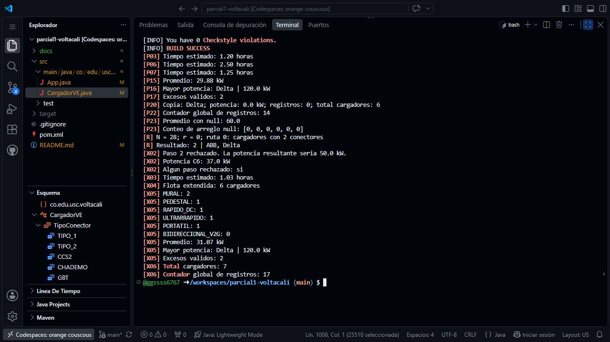

# Parcial 1 - VoltaCali

Prototipo de consola en Java 8 y Maven para gestionar cargadores de vehículos
eléctricos de VoltaCali S.A.S. Se conservan el `pom.xml` del archetype y su
configuración de Checkstyle, así como el `AppTest.java` generado.

## Estudiante y personalización

| Dato | Valor |
| --- | --- |
| Nombre | Edinson Andrés Palacios Muñoz |
| Código estudiantil | 1105370028 |
| N | 28 |
| d1, d2 | 2, 8 |
| r = N mod 4 | 0 |
| Ruta asignada | `cargadoresPorConectores(CargadorVE[], int)` |
| Cantidad buscada | N mod 3 + 1 = 2 conectores |

La ruta se ejecuta después de P23 sobre la flota original. Encuentra ABB y Delta.
El cargador C6 se agrega después de la ruta, en un arreglo nuevo de seis posiciones.
La copia técnica de P20 cuenta como objeto creado, pero no pertenece a la flota.

## Compilar y ejecutar

Desde la raíz del repositorio, con JDK 8 o posterior y Maven 3.6.3 o posterior:

```sh
mvn clean compile
java -cp target/classes co.edu.usc.voltacali.App
```

La configuración de compilación se mantiene en Java `1.8`.

- `groupId`: `co.edu.usc.voltacali`
- `artifactId`: `parcial1-voltacali`
- Paquete: `co.edu.usc.voltacali`

## Atributos calculados de C6

Los valores se calculan en `App.crearC6` a partir de N; esta tabla documenta
el resultado para N = 28.

| Atributo | Regla | Valor |
| --- | --- | --- |
| fabricante | `"USC-" + N` | USC-28 |
| anioInstalacion | 2015 + d2 | 2023 |
| voltajeNominal | 220 si N es par; 400 si es impar | 220 V |
| tipoConector | `TipoConector.values()[N % 5]` | CHADEMO |
| tipoCargador | `TipoCargador.values()[N % 6]` | PORTATIL |
| numeroConectores | d1 % 3 + 1 | 3 |
| puestosParqueo | d2 % 4 + 1 | 1 |
| potenciaMaxima | 20 + N | 48 kW |
| ubicacion | `Ubicacion.values()[N % 8]` | RESIDENCIAL |
| potenciaActual inicial | Constructor completo | 0 kW |

En X02 inicia en 24 kW y aumenta 13 kW por paso, hasta tres pasos.
El primero deja 37 kW; el segundo se rechaza porque produciría 50 kW,
por encima del máximo de 48 kW. La operación se detiene y no intenta el tercero.

## Revisión del enunciado

| Parte | Implementación |
| --- | --- |
| A | Diez atributos privados con getters/setters; potencia inválida conserva el estado y se registra |
| B | Aumento, reducción, corte, tiempo estimado y presentación de atributos |
| C | Tres constructores, tres aumentos, tres cálculos de tiempo, tres filtros y dos métodos mostrar |
| D | Enums en el orden requerido; clase interna no estática; Vector; instantáneas y contadores globales |
| E | P01–P23 en el orden obligatorio, con código al inicio de cada línea |
| R | Ruta 0 para N = 28, filtro por dos conectores y control de resultado vacío |
| F | C6 calculado desde N y ejecución X01–X06 |

Los filtros retornan arreglos nuevos de tamaño exacto. Las posiciones `null`
se omiten; un arreglo `null` produce conteos y promedio en cero, filtros vacíos
y máximo `null`. Calcular tiempos y mostrar datos no crea registros.
Solo los registros válidos cuya potencia es **mayor** que 50 kW cuentan como excesos.
El constructor copia conserva características técnicas, reinicia la potencia
y crea su propia bitácora vacía.

## Resultados de referencia

Estos resultados son una comprobación de la ejecución, no valores usados por
el programa para sustituir cálculos.

| Paso | Resultado |
| --- | --- |
| P03, P06, P07 | 1.20 h; 2.50 h; 1.25 h |
| P09 | 45.0 kW |
| P12 | -1.00 h, con mensaje de potencia cero |
| P14 | MURAL 2; PEDESTAL 1; RAPIDO_DC 1; ULTRARRAPIDO 1; PORTATIL 0; BIDIRECCIONAL_V2G 0 |
| P15, P16 | Promedio 29.88 kW; máximo Delta, 120.0 kW |
| P17 | 2 excesos válidos |
| P18 | TIPO_2: Siemens, Wallbox, Enel X; MURAL: Siemens, Wallbox; UNIVERSIDAD: ABB |
| P20 | Copia con 0 kW y 0 registros; 6 objetos creados |
| P21, P22 | C1: 10 registros (8 válidos, 2 inválidos); contador global 14 |
| P23 | Promedio 60.0; seis ceros para contarPorTipo(null) |
| R | N = 28, r = 0; ABB y Delta |
| X02, X03 | Potencia final 37.0 kW; segundo paso rechazado; 1.03 horas |
| X04 | Arreglo nuevo con 6 cargadores |
| X05 | Promedio 31.07 kW; máximo Delta, 120.0 kW; 2 excesos; PORTATIL sube a 1 |
| X06 | 7 objetos creados; 17 registros globales; C6 tiene 2 válidos y 1 inválido |

Los tiempos se imprimen con dos decimales mediante `Locale.US`.
Se comprobaron adicionalmente 67 condiciones sobre encapsulamiento,
constructores, sobrecargas, rechazos, historial, filtros y arreglos nulos/vacíos.

## Estructura y evidencia

```text
parcial1-voltacali/
├── pom.xml
├── .gitignore
├── README.md
├── src/main/java/co/edu/usc/voltacali/
│   ├── App.java
│   └── CargadorVE.java
├── src/test/java/co/edu/usc/voltacali/
│   └── AppTest.java
└── docs/
    ├── captura.png
    └── ejecucion.txt
```

`target/` no se sube al repositorio. La captura corresponde a la ejecución
desde la terminal de Visual Studio Code en GitHub Codespaces. La salida
completa también está disponible en [docs/ejecucion.txt](docs/ejecucion.txt).


